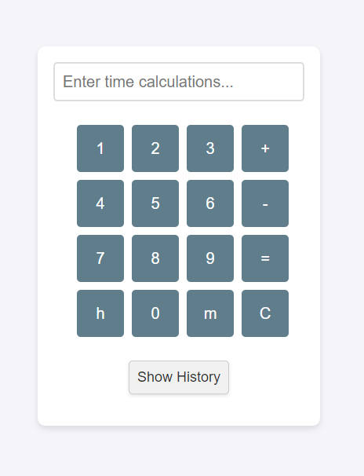
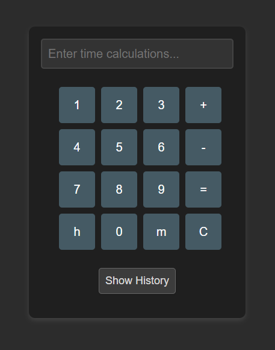

# Time Calculator

A simple yet effective time calculator built with HTML, CSS, and JavaScript. The calculator lets you easily perform time arithmetic with inputs in hours (`h`) and minutes (`m`). It also keeps track of your calculation history for quick reference.

<p align="center">
  
  
</p>


## Features

- **Time Arithmetic:** Add and subtract time values like "1h30m" and "45m."
- **Responsive Design:** Looks great on different devices.
- **History Tracking:** Review past calculations and copy their results to the current input.
- **Keyboard Support:** Use the keyboard or the on-screen buttons for input.
- **Dark Mode:** Automatically adapts to the browser's color scheme preference.

## Getting Started

### Prerequisites

Ensure you have a modern web browser like Chrome, Firefox, Edge, or Safari. The project doesn't require any special dependencies.

### Installation

1. **Download the Project:**
   - Clone the repository:
     ```bash
     git clone https://github.com/Fruehwirth/Time-Calculator
     ```
   - Or download the ZIP file and extract it.

2. **Run the Project:**
   - Open the `index.html` file directly in a browser.
   - Or serve the directory via a simple HTTP server (recommended) to avoid browser security policies.

### Usage

- **Input:** Use the on-screen keyboard or your actual keyboard to enter time calculations.
- **Operators:** Use `+` to add and `-` to subtract time values.
- **Toggle History:** Click the "Show History" button to view past calculations.

### Keyboard Shortcuts

- **Numbers:** `0` to `9`
- **Time Units:** `h` for hours, `m` for minutes
- **Operators:** `+` and `-`
- **Calculate:** `Enter` key
- **Clear Input:** `Escape` key
- **Backspace:** Remove the last character or operator

### Example Calculations

1. `1h + 30m`
2. `2h - 45m`
3. `3h + 1h45m - 30m`

## Contributing

Contributions, bug reports, and feature requests are welcome. Feel free to open an issue or submit a pull request.

### Development Notes

- **JavaScript Modules:** The project uses ES6 modules to separate different functions for modularity.
- **History Management:** Calculation history is stored in `localStorage` and will persist between sessions.

## License

This project is licensed under the MIT License - see the [LICENSE](LICENSE) file for details.
